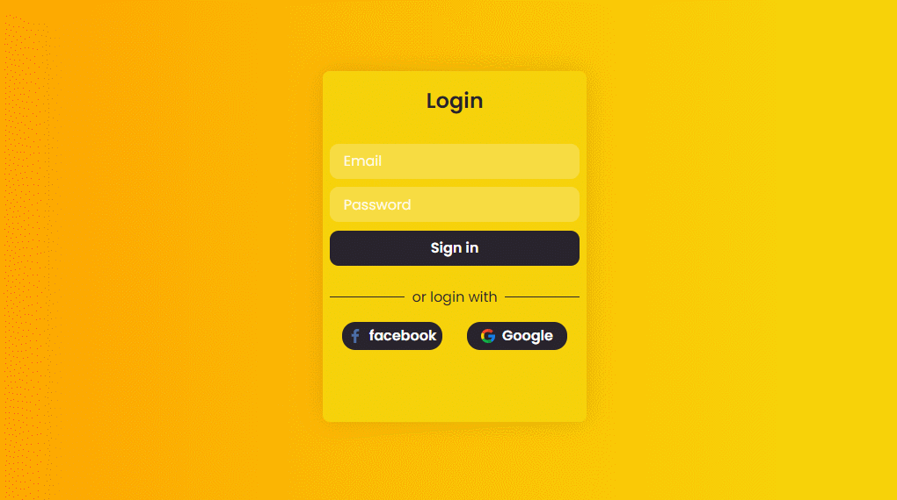
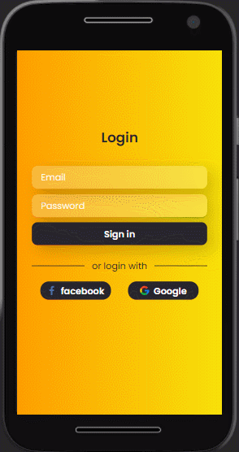

# Página de Login

## Tecnologias 
* HTML
* CSS

## Principal Objetivo 
* Praticar o uso das ferramentas do modelo de renderização ``flexbox`` e trabalhar com elementos de formulários

## Experiência Adquirida 
* Coloquei em prática o que estudei sobre posicionamentos utilizando o modelo ``flexbox`` para o ``<display>``

* Consegui entender de fato o que estava acontencendo com o posicionamento dos elementos, pensando em cada elemento como um box

* Apliquei o que estudei sobre elementos básicos de um formulário, como ``<form></form>``, ``<input>s ``e seus atributos

* O método de criar um botão sem usar necessariamento um ``<button></button> `` ou ``<input type="submit">``, mas usando e estilizando a tag âncora ``<a>``

* Primeiro contato com o conceito de resposividade, usando <em>Media Queries</em> e os <em>Breakpoints</em>. Entendimento sobre o uso da função CSS ``calc()`` e das unidades de medida ``rem`` e ``%``

## Demonstração

  

  

